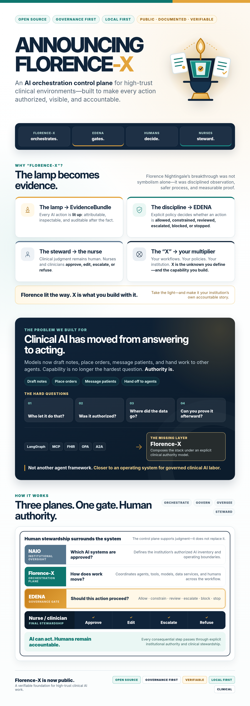

# Announcing Florence-X

**An open-source, governance-first, local-first AI orchestration control plane for
high-trust clinical environments — now public, documented, and verifiable.**

> Florence-X orchestrates. EDENA gates. Humans decide. Nurses steward.

---

## Why "Florence-X"?
Florence Nightingale is remembered for the lamp she carried through the dark
wards — but her revolution was **evidence**. She counted, charted, and proved that
disciplined observation and safer process saved lives. She brought light to the
human condition, made care measurably better, and made the nurse its steward.

Florence-X carries that forward into the age of AI that *acts*. The lamp is the
**EvidenceBundle** — every action lit up, accountable, auditable. The discipline
is the **EDENA gate**. The steward is still the **nurse**.

And the **"X" is the unknown — the multiplier you bring.** Take the light and make
it your own story: your workflows, your policies, your institution. Florence lit
the way; *X* is what you build with it.

---

## The problem we built for
Clinical AI has moved from *answering* to *acting* — drafting notes, placing
orders, messaging patients, handing off to other agents. The hard question is no
longer "can the model answer?" but: **who let it do that, was it authorized, where
did the data go, and can you prove it afterward?**

LangGraph, MCP, FHIR, OPA, and A2A each solve a slice. None is a governance-first
clinical orchestration plane. Florence-X is the missing layer that composes them
under an explicit authority model.

Florence-X is **not another agent framework.** Frameworks help you *build* agents;
Florence-X helps an institution *govern AI labor* — closer to an operating system
for clinical AI work than a chatbot.

## How it works — three planes, one gate
| Plane | Role |
|---|---|
| **Florence-X** | Orchestration — how work moves through agents, tools, models, humans |
| **EDENA** | Governance — should an action be allowed, constrained, reviewed, escalated, blocked, stopped |
| **NAIO** | Institutional oversight — which AI systems are approved |
| **Nurse / clinician** | Stewardship — approves, edits, escalates, refuses |

The non-negotiable invariant: **no consequential action executes without a
`CandidateAction` passing EDENA — and EDENA fails closed.** If governance is
unreachable, irreversible or external work is denied, never silently allowed.

## What's in the release (Phases 0–5, complete)
- **Policy-as-code gating** — OPA/Rego packs, a five-tier risk ladder, per-workflow
  overlays; decisions versioned and stamped onto every run.
- **Durable execution with real human-in-the-loop** — the canonical loop on
  LangGraph: a review interrupt is a *checkpoint*, so a paused run survives a
  restart and resumes on approval ([RFC 0007](rfcs/0007-durable-execution-langgraph.md)).
- **Evidence by default** — every run yields an `EvidenceBundle`: decisions,
  rationale, human reviews, tool calls, source citations, model/agent + policy-pack
  versions.
- **An enforced PHI boundary** — objects carry hashes/refs, never raw payloads;
  PHI-bearing work routes to local models; non-local sends are redacted and
  *refused* if PHI survives ([PHI model](phi-boundary-model.md)).
- **A governed tool gateway** — agents never call tools directly; every invocation,
  including A2A handoffs, is a `CandidateAction → EDENA`, deny-by-default. FHIR R4,
  CDS Hooks, SMART launch, and an Ollama adapter for local inference.
- **A steward console** (Next.js) built around the anti-rubber-stamp principle:
  blast radius, reversibility, source evidence, EDENA rationale — never a bare
  approve button — with live WebSocket run state.
- **Observability + latency as safety** — OpenTelemetry tracing and a ≤2–3s
  point-of-care budget.

## Don't take it on faith — *verify it*
The part that matters for adopters: every claim is **adversarially tested and
reproducible on your machine, on synthetic data.**

- **Attack suite** — `tests/redteam/` runs 31 attacks against the five invariants,
  including a **structural proof** that the runtime's tool-execution step is
  unreachable except through the gate. The [assurance matrix](assurance.md) maps
  each invariant → attack → test.
- **A live run, not mocks** — `make e2e` boots a real OPA server + the real HTTP API
  + the durable runtime and re-checks the invariants end-to-end. *That run already
  caught a real bug the mocked tests missed* (append-only evidence shadowing on
  resume) — see [live-e2e.md](live-e2e.md). We publish the bugs our own proofs find.
- **30-minute self-eval** — `make install && make opa-install && make eval` proves
  the governance claims yourself ([eval.md](eval.md)).
- **Pilot-ready** — `make pilot-report` scores the workflows against acceptance
  gates (every action gated, zero PHI egress, refusals recorded, latency in
  budget); a full [pilot kit](pilot.md) with charter, criteria, and a compliance
  checklist.

## For healthcare AI developers
You already have the pieces. Florence-X is the substrate that composes them under
an auditable authority model, so *"can we safely let this AI act?"* becomes an
artifact instead of a hope. Built on open standards — MCP, FHIR R4, SMART, CDS
Hooks, A2A, OpenTelemetry, CloudEvents, OpenAPI — so you plug in rather than rip
out.

!!! warning "Not a medical device"
    Research / infrastructure software, **not** cleared for clinical use. The
    release uses **synthetic data only**. Refusal and containment are treated as
    *successful* governance outcomes — because in clinical AI, a confident wrong
    action is the failure mode that matters. See `CLINICAL_SAFETY.md`.

## Get started
- **Repo:** <https://github.com/AI-Nurse-Solutions/florence-x> (Apache-2.0)
- **Verify it:** [Evaluate in 30 minutes](eval.md)
- **Break it:** [the challenge](CHALLENGE.md) — a clean bypass/leak/tamper is the
  bug we most want; report via a private security advisory.
- **Pilot it:** [design-partner pilot kit](pilot.md)

If you're building agentic systems near patient care, we'd value your eyes on the
[architecture](architecture.md), the [EDENA contract](edena-integration.md), and
the [threat model](threat-model.md).

Florence Nightingale made care safer by insisting on evidence. Florence-X makes AI
safe to *act* the same way — and hands you the lamp.

_Sharing this? Ready-to-post copy: [announcement-social.md](announcement-social.md)._

---

